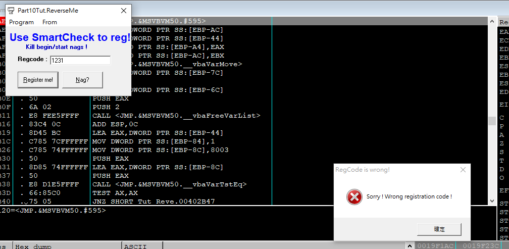
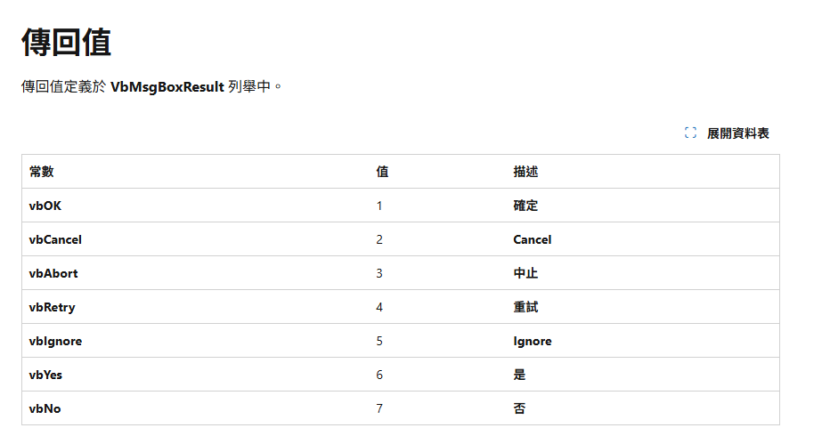
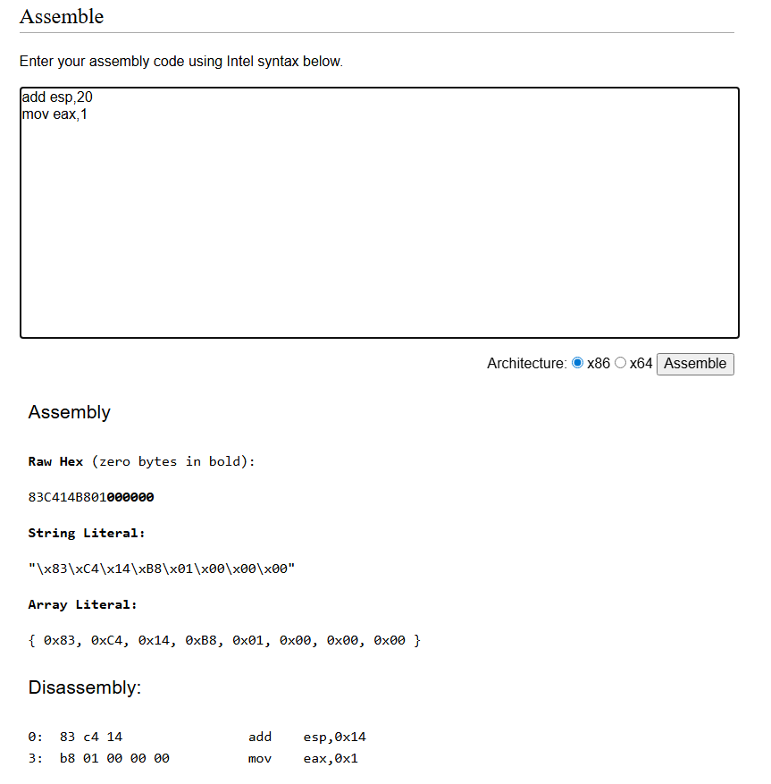
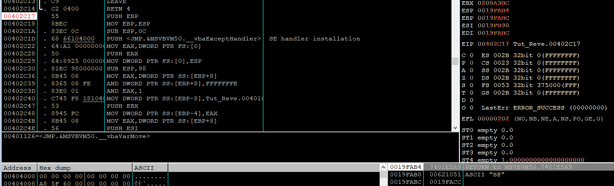
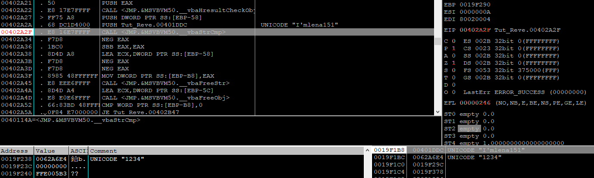

[search for] -> [All intermodular calls] -> [set breakpoint on every call to rtcMsgBox]


原本 共5个 byte
```
call <jmp.&MSVBVM50.#595>
```

修改 
```
add esp,14
nop
nop
```
失败的原因是rtcMsgBox 有传回值


使用https://defuse.ca/online-x86-assembler.htm#disassembly

这样却超过5个byte

只能另寻他法

找到这个函式的起始位置 00402C17, 干脆直接不进来


看到 ESP 指向 RETURN TO 7401E5A9

透过 CALL EAX ，看里面有多少个参数


有一个参数， 

原本 3 个 byte
```
push ebp
mov ebp, esp
```

修改 
```
retn 4 -> 相当于 pop eip + add esp,4
```
还是3个 byte,然后顺便pop 掉一个 参数

然后执行后随便输入 reg code 后会 break 在 call rtcMsgBox 
然后我们 [search for] -> [All referenced text strings]
我们去到 RegCode is wrong ! 的 text 附近往上scroll 发现到比较 regcode 的逻辑


push [ebp-58] ,发现到确实是我们刚刚的输入
因此 regcode 是 I'mlena151

