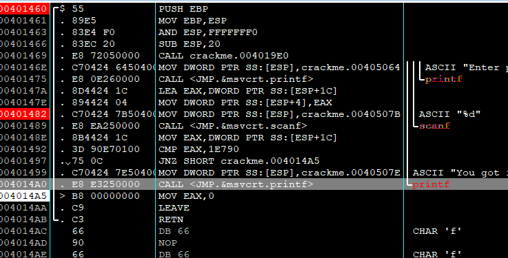

### Very easy disassembly exercise — Writeup
由于题目只是要取出硬编码整数，无需逆向完整演算法

### Links
https://crackmes.one/crackme/68a346c48fac2855fe6fb6df

#### Tools
- ollydbg

### Steps

1. 在 Intermodular Calls，对printf 设置断点
2. 执行后自动断在 printf
3. 发现在 Main 程式内有 `cmp eax, 1E790`
4. 0x1E790 = 124816(十进位)。输入 124816 即显示"You got it"
