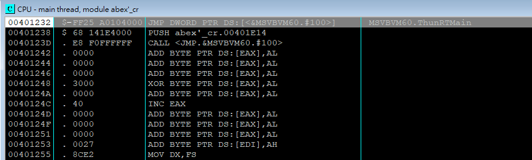
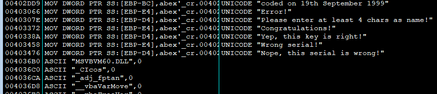
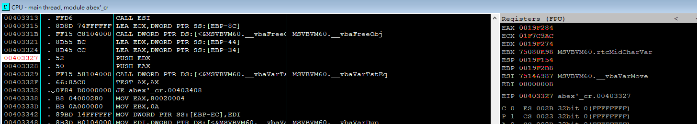
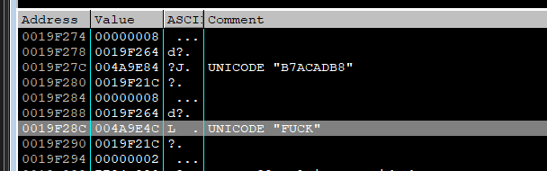
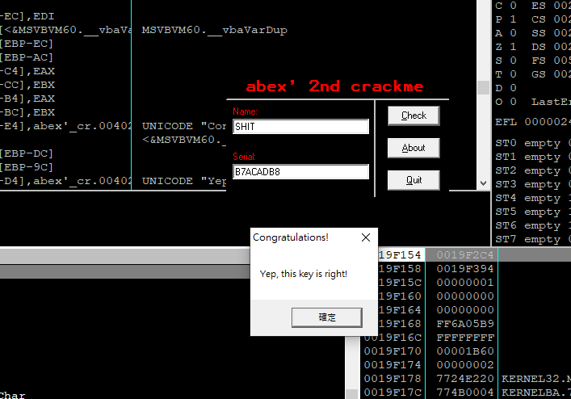

`ALT+F9(Execute till User Code)` + `F8(Step Over)` + `F7(Step Into)`

我们看到了ThunkRTMain, 这个是Visual Basic 6 的启动函式，包括初始化VB6 执行环境，载入VB专案结构，解析命令与启动设定，呼叫ProcCallEngine 来执行p-code(VB6 预设是 p-code 编译)等等。
我们不需要Jmp 进去分析引擎代码。因此我们直接在这里搜寻关键字(Search for -> All referenced text strings)

双击点进去，这里一定有条件判断来分辨我们输入的是否与系统的一样，JE/JNE 之类的命令.

我们可以在PUSH EDX/EAX / CALL __vbaVarstEq 这里设置断点，由于上面有LEA EAX/EDX 在按下check 的时候EAX 和 EDX 的值会变，然后再call vbavartsteq 去做比较，我们可以查看 EAX/EDX 里面的值
ALT+F9, 我们输入 Name: SHIT, Serial: FUCK

可以看出EAX 是用户输入， EDX 是系统的Serial Code。两者会做比较。

